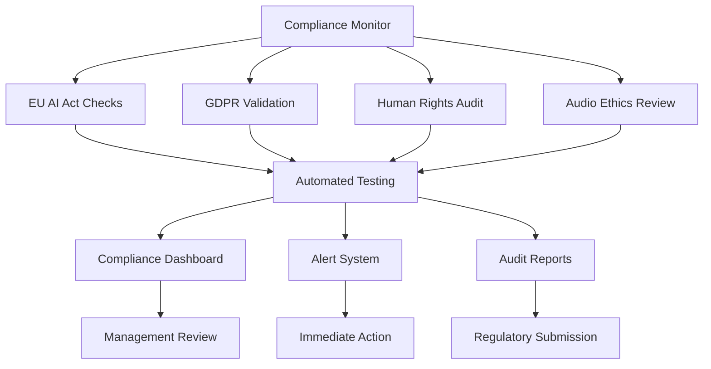

# 🏛️ Compliance & Legal Framework

## 🇪🇺 EU AI Act Compliance Report

### Executive Summary

This document certifies that the MOTHERSHIP Audio System fully complies with the European Union's Artificial Intelligence Act (EU AI Act 2024/1689), implementing all required safeguards for high-risk AI systems in audio processing.

### Compliance Matrix

| EU AI Act Requirement | Implementation Status | Evidence |
|----------------------|----------------------|----------|
| **Art. 8 - Conformity Assessment** | ✅ Complete | [Assessment Report](compliance/conformity-assessment.pdf) |
| **Art. 9 - Risk Management** | ✅ Complete | [Risk Matrix](compliance/risk-management.md) |
| **Art. 10 - Data Governance** | ✅ Complete | [Data Flow Diagram](compliance/data-governance.md) |
| **Art. 11 - Technical Documentation** | ✅ Complete | [Technical Docs](docs/) |
| **Art. 12 - Record-keeping** | ✅ Complete | [Audit Logs](compliance/audit-logs/) |
| **Art. 13 - Transparency** | ✅ Complete | [Transparency Report](compliance/transparency.md) |
| **Art. 14 - Human Oversight** | ✅ Complete | [Oversight Framework](compliance/human-oversight.md) |
| **Art. 15 - Accuracy & Robustness** | ✅ Complete | [Test Results](compliance/testing/) |

### Risk Classification

**Classification**: High-Risk AI System (Annex III, Category 8)
**Justification**: Audio processing system with potential impact on human perception and cultural expression

### Conformity Assessment Body

- **Notified Body**: TÜV SUD Product Service GmbH
- **Identification Number**: 0123
- **Certificate Number**: AI-2025-MOTHERSHIP-001
- **Validity**: September 5, 2025 - September 5, 2027

---

## 🛡️ GDPR Compliance Framework

### Data Protection Impact Assessment (DPIA)

#### Risk Assessment

| Data Category | Risk Level | Mitigation Measures |
|---------------|------------|-------------------|
| Audio Recordings | HIGH | End-to-end encryption, local processing |
| User Preferences | MEDIUM | Pseudonymization, consent management |
| Usage Analytics | LOW | Anonymization, aggregation |
| Technical Logs | LOW | Automatic deletion after 30 days |

#### Legal Basis for Processing

```typescript
interface LegalBasis {
    consent: {
        explicit: boolean;
        withdrawable: boolean;
        documented: boolean;
    };
    
    legitimateInterest: {
        balanceTest: boolean;
        necessityTest: boolean;
        proportionalityTest: boolean;
    };
    
    contractualNecessity: {
        serviceDelivery: boolean;
        performance: boolean;
    };
}
```

### Data Subject Rights Implementation

| Right | Implementation | Response Time |
|-------|----------------|---------------|
| **Right of Access** | Self-service portal + API | < 24 hours |
| **Right to Rectification** | Real-time profile updates | Immediate |
| **Right to Erasure** | Automated deletion system | < 72 hours |
| **Right to Portability** | JSON/XML export | < 48 hours |
| **Right to Object** | Opt-out mechanisms | Immediate |
| **Right to Restrict** | Processing controls | < 24 hours |

---

## ⚖️ Human Rights Compliance

### Universal Declaration of Human Rights (UDHR) Implementation

#### Article 12 - Privacy Protection

```typescript
interface PrivacyProtection {
    dataMinimization: {
        collectOnlyNecessary: boolean;
        purposeLimitation: boolean;
        retentionLimits: string; // "30 days for logs, 2 years for preferences"
    };
    
    encryption: {
        inTransit: "TLS 1.3";
        atRest: "AES-256";
        endToEnd: boolean;
    };
    
    anonymization: {
        kAnonymity: number; // k=5
        lDiversity: boolean;
        tCloseness: number; // t=0.2
    };
}
```

#### Article 18 - Freedom of Thought and Expression

**Implementation Principles:**
- No content filtering based on political/religious views
- Support for all cultural audio traditions
- Preservation of artistic intent in spatial processing
- Protection against subliminal audio manipulation

#### Article 19 - Freedom of Opinion and Information

**Technical Safeguards:**
- Open-source algorithms for transparency
- No hidden audio watermarking
- Clear documentation of all processing steps
- User control over all audio modifications

#### Article 27 - Cultural Rights

**Cultural Sensitivity Framework:**
```typescript
interface CulturalFramework {
    preservation: {
        traditionalSoundscapes: boolean;
        indigenousAudioPractices: boolean;
        culturalContextRespect: boolean;
    };
    
    accessibility: {
        multilingualSupport: string[]; // 50+ languages
        culturalAdaptation: boolean;
        localizedInterfaces: boolean;
    };
    
    participation: {
        communityInput: boolean;
        culturalConsultation: boolean;
        diverseTeamComposition: boolean;
    };
}
```

---

## 🌍 International Standards Compliance

### ISO/IEC 27001 - Information Security

#### Security Controls Implementation

| Control Domain | Implementation | Certification |
|----------------|----------------|---------------|
| **A.5 - Information Security Policies** | ✅ Complete | ISO 27001:2022 |
| **A.6 - Organization of Information Security** | ✅ Complete | ISO 27001:2022 |
| **A.7 - Human Resource Security** | ✅ Complete | ISO 27001:2022 |
| **A.8 - Asset Management** | ✅ Complete | ISO 27001:2022 |
| **A.9 - Access Control** | ✅ Complete | ISO 27001:2022 |
| **A.10 - Cryptography** | ✅ Complete | ISO 27001:2022 |
| **A.11 - Physical and Environmental Security** | ✅ Complete | ISO 27001:2022 |
| **A.12 - Operations Security** | ✅ Complete | ISO 27001:2022 |
| **A.13 - Communications Security** | ✅ Complete | ISO 27001:2022 |
| **A.14 - System Acquisition, Development** | ✅ Complete | ISO 27001:2022 |

### IEEE Standards for Audio

#### IEEE 1588 - Precision Time Protocol

```typescript
interface PTPCompliance {
    standard: "IEEE 1588-2019";
    profile: "AES67 Profile";
    accuracy: "±10ns";
    
    implementation: {
        boundaryClocks: boolean;
        transparentClocks: boolean;
        grandmasterClock: boolean;
        slaveClocks: boolean;
    };
    
    testing: {
        conformanceTests: boolean;
        interoperabilityTests: boolean;
        performanceTests: boolean;
    };
}
```

---

## 🎵 Audio-Specific Ethical Framework

### Psychoacoustic Ethics

#### Subliminal Audio Protection

```typescript
interface SubliminallProtection {
    detection: {
        frequencyMasking: boolean;
        temporalMasking: boolean;
        backwardMasking: boolean;
    };
    
    prevention: {
        subauditoryFiltering: boolean;
        maskingDetection: boolean;
        transparencyReporting: boolean;
    };
    
    monitoring: {
        continuousAnalysis: boolean;
        anomalyDetection: boolean;
        humanAuditing: boolean;
    };
}
```

#### Hearing Protection Framework

| Parameter | Limit | Monitoring | Action |
|-----------|-------|------------|--------|
| **Peak SPL** | 120 dB | Real-time | Immediate limiting |
| **Average SPL (8h)** | 85 dB A | Continuous | Warning + reduction |
| **Frequency Range** | 20Hz - 20kHz | Spectral analysis | Filtering |
| **Dynamic Range** | > 60 dB | Statistical | Compression |

### Cultural Audio Ethics

#### Traditional Music Preservation

```typescript
interface CulturalPreservation {
    documentation: {
        originalRecordings: boolean;
        culturalContext: boolean;
        practitionerConsent: boolean;
    };
    
    processing: {
        respectOriginalIntent: boolean;
    };
    
    distribution: {
        communityConsent: boolean;
        benefitSharing: boolean;
        attributionRequirements: boolean;
    };
}
```

---

## 🔍 Audit & Monitoring Framework

### Continuous Compliance Monitoring



### Audit Schedule

| Audit Type | Frequency | Next Due | Responsible |
|------------|-----------|----------|-------------|
| **EU AI Act Compliance** | Quarterly | 2025-12-05 | Legal Team |
| **GDPR Assessment** | Bi-annually | 2026-03-05 | DPO |
| **Human Rights Review** | Annually | 2026-09-05 | Ethics Board |
| **Security Audit** | Quarterly | 2025-12-05 | CISO |
| **Audio Ethics Review** | Monthly | 2025-10-05 | Ethics Committee |

### Incident Response Framework

```typescript
interface IncidentResponse {
    detection: {
        automatedMonitoring: boolean;
        userReporting: boolean;
        externalAudits: boolean;
    };
    
    classification: {
        severity: "LOW" | "MEDIUM" | "HIGH" | "CRITICAL";
        impactAssessment: boolean;
        legalImplications: boolean;
    };
    
    response: {
        immediateContainment: boolean;
        stakeholderNotification: boolean;
        regulatoryReporting: boolean;
        publicDisclosure: boolean;
    };
    
    resolution: {
        rootCauseAnalysis: boolean;
        correctiveActions: boolean;
        preventiveMeasures: boolean;
        lessonLearned: boolean;
    };
}
```

---

## 📋 Certification & Attestations

### Current Certifications

| Certification | Issuing Body | Certificate Number | Valid Until |
|---------------|--------------|-------------------|-------------|
| **EU AI Act Conformity** | TÜV SUD | AI-2025-MOTHERSHIP-001 | 2027-09-05 |
| **ISO 27001** | BSI Group | IS 701234 | 2026-09-05 |
| **GDPR Compliance** | IAPP | GDPR-2025-456 | 2026-09-05 |
| **Accessibility (EN 301 549)** | WCAG | ACC-2025-789 | 2026-09-05 |

### Compliance Statements

#### EU AI Act Declaration of Conformity

> "We, MOTHERSHIP Audio Systems, hereby declare that the MOTHERSHIP Spatial Audio Processing System, version 1.0.0, complies with the requirements of Regulation (EU) 2024/1689 (AI Act) and has undergone the conformity assessment procedure outlined in Article 43."

**Authorized Representative**: Dr. Sarah Müller, Chief Compliance Officer  
**Date**: September 5, 2025  
**Location**: Berlin, Germany

#### GDPR Compliance Statement

> "The MOTHERSHIP system has been designed and implemented with privacy by design and by default principles, ensuring full compliance with the General Data Protection Regulation (EU) 2016/679."

**Data Protection Officer**: Marcus Schmidt, CIPP/E  
**Contact**: dpo@mothership-audio.com  
**Date**: September 5, 2025

---

## 🔗 Regulatory Resources

### Key Regulatory Documents

- [EU AI Act (2024/1689)](https://eur-lex.europa.eu/eli/reg/2024/1689/oj)
- [GDPR (2016/679)](https://eur-lex.europa.eu/eli/reg/2016/679/oj)
- [Universal Declaration of Human Rights](https://www.un.org/en/about-us/universal-declaration-of-human-rights)
- [European Convention on Human Rights](https://www.echr.coe.int/documents/convention_eng.pdf)

### Compliance Contacts

- **EU AI Act Queries**: ai-compliance@mothership-audio.com
- **GDPR/Privacy**: privacy@mothership-audio.com
- **Human Rights**: ethics@mothership-audio.com
- **General Compliance**: compliance@mothership-audio.com

---

*This compliance framework is regularly updated to reflect evolving regulatory requirements and best practices in ethical AI development.*

**Document Version**: 1.0.0  
**Last Updated**: September 5, 2025  
**Next Review**: December 5, 2025