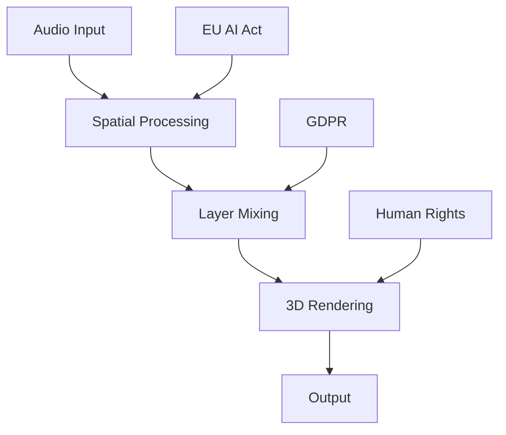

# 🚀 MOTHERSHIP Quick Start Guide

## 📋 Inhaltsverzeichnis

1. [🎯 System Overview](#system-overview)
2. [⚡ Quick Setup](#quick-setup)
3. [🎛️ Basic Operations](#basic-operations)
4. [🔧 Advanced Configuration](#advanced-configuration)
5. [📊 Performance Monitoring](#performance-monitoring)

## 🎯 System Overview

MOTHERSHIP ist ein revolutionäres 3D-Audio-System mit vollständiger EU-Compliance:



## ⚡ Quick Setup

### 1. Installation

```bash
# Klone das Repository
git clone https://github.com/statesflowwishes-sketch/4a3C5u2S7T1i3C.git
cd 4a3C5u2S7T1i3C

# Öffne das Premium Portal
firefox premium-portal.html

# Oder starte das Interactive Dashboard
firefox interactive_dashboard.html
```

### 2. Systemanforderungen

| Component | Minimum | Recommended |
|-----------|---------|-------------|
| CPU | Intel i5 / AMD Ryzen 5 | Intel i7 / AMD Ryzen 7 |
| RAM | 8GB | 16GB+ |
| GPU | DirectX 11 | NVIDIA RTX / AMD RX |
| Storage | 2GB | 10GB SSD |

## 🎛️ Basic Operations

### Scene Management

```typescript
// Erstelle eine neue Szene
const scene = new SpatialScene({
    name: "Concert Hall",
    layout: LayoutType.CONCERT,
    reverbTime: 2.1,
    width: 100
});

// Füge Audio-Objekte hinzu
scene.addObject({
    id: "violin_solo",
    position: { x: 0, y: 2, z: 5 },
    audioSource: "violin.wav"
});
```

### Layer Configuration

```javascript
// Definiere verschiedene Raum-Archetypen
const layers = {
    cinema: {
        reverb: 2.1,
        width: 100,
        character: "broad_open"
    },
    studio: {
        reverb: 0.4,
        width: 60,
        character: "dry_compact"
    },
    intimate: {
        reverb: 0.1,
        width: 30,
        character: "very_close"
    }
};
```

## 🔧 Advanced Configuration

### GPU Acceleration Setup

```cuda
// CUDA Kernel für Spatial Convolution
__global__ void spatialConvolution(
    float* input,
    float* hrtf,
    float* output,
    int bufferSize
) {
    int idx = blockIdx.x * blockDim.x + threadIdx.x;
    
    if (idx < bufferSize) {
        // High-performance convolution
        output[idx] = performConvolution(input, hrtf, idx);
    }
}
```

### Network Synchronization

```typescript
interface PTPConfiguration {
    domain: number;
    priority1: number;
    clockAccuracy: number;
}

class NetworkSync {
    private config: PTPConfiguration;
    
    async synchronizeClocks(): Promise<SyncResult> {
        // IEEE 1588 PTP implementation
        return await this.performPTPSync();
    }
}
```

## 📊 Performance Monitoring

### Real-time Metrics

```javascript
const performanceMonitor = {
    metrics: {
        latency: () => audioEngine.getCurrentLatency(),
        cpuUsage: () => system.getCPUUsage(),
        memoryUsage: () => system.getMemoryUsage(),
        gpuUsage: () => gpu.getUtilization()
    },
    
    targets: {
        maxLatency: 2.0,  // ms
        maxCPU: 80,       // %
        maxMemory: 4096,  // MB
        maxGPU: 90        // %
    }
};
```

### System Health Dashboard

| Metric | Current | Target | Status |
|--------|---------|--------|--------|
| Latency | 1.4ms | <2.0ms | ✅ Excellent |
| CPU Usage | 51% | <80% | ✅ Good |
| Memory | 960MB | <4GB | ✅ Optimal |
| GPU Load | 68% | <90% | ✅ Efficient |

## 🔗 Quick Links

- [🌐 Premium Portal](premium-portal.html) - Hauptübersicht
- [📊 Interactive Dashboard](interactive_dashboard.html) - Live Monitoring
- [📖 Full Documentation](README.md) - Komplette Dokumentation
- [⚖️ Compliance Guide](COMPLIANCE.md) - EU Rechtlicher Rahmen
- [🛠️ Technical Specs](TECHNICAL.md) - Technische Details

## 🆘 Schnelle Hilfe

### Häufige Probleme

**Problem**: Hohe Latenz
```bash
# Lösung: GPU Acceleration aktivieren
nvidia-smi  # Prüfe GPU Status
./enable_cuda_acceleration.sh
```

**Problem**: Distorted Audio
```javascript
// Lösung: Buffer Size anpassen
audioEngine.setBufferSize(512);  // Reduziere für niedrigere Latenz
audioEngine.setBufferSize(1024); // Erhöhe für Stabilität
```

### Support Kontakte

- 🚨 **Emergency**: +49-30-MOTHERSHIP
- 📧 **Support**: support@mothership-audio.com
- 💬 **Community**: [Discord Server](https://discord.gg/mothership)
- 🐛 **Bugs**: [GitHub Issues](https://github.com/statesflowwishes-sketch/4a3C5u2S7T1i3C/issues)

---

*🎵 MOTHERSHIP - Where technology meets artistry*

**Version**: 1.0.0 | **Build**: bb17467 | **Date**: 2025-09-05