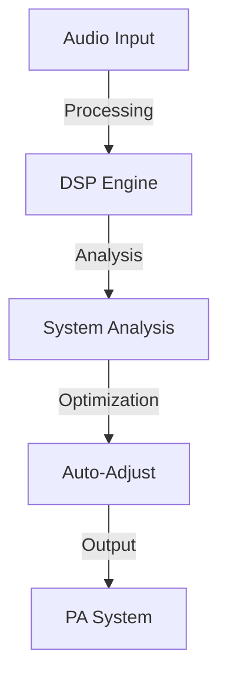
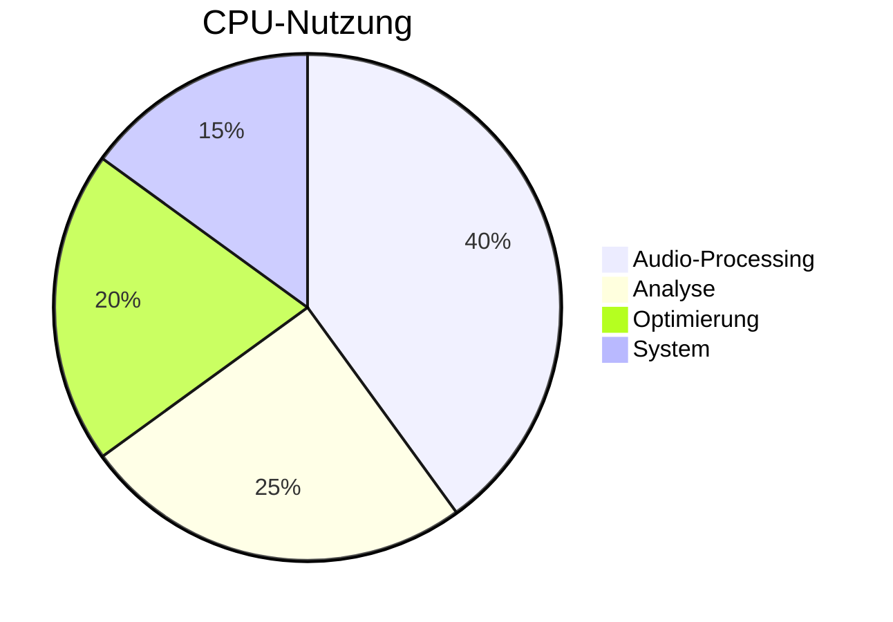

# 🎵 Akustic System Pro

<details>
<summary>📑 Inhaltsverzeichnis</summary>

- [🎯 Überblick](#-überblick)
- [🚀 Features](#-features)
  - [🎛️ Kernfunktionen](#️-kernfunktionen)
  - [🔊 Sound-Optimierung](#-sound-optimierung)
  - [🌐 Vernetzung](#-vernetzung)
  - [📊 Analyse](#-analyse)
- [⚡ Performance-Optimierung](#-performance-optimierung)
  - [💻 Hardware-Beschleunigung](#-hardware-beschleunigung)
  - [🔄 Synchronisierung](#-synchronisierung)
- [🏗️ Infrastruktur-Integration](#️-infrastruktur-integration)
  - [🎪 Venue-Management](#-venue-management)
  - [🎵 PA-Systeme](#-pa-systeme)
- [📈 Technische Details](#-technische-details)
- [🛠️ Installation](#️-installation)
- [📚 Dokumentation](#-dokumentation)
- [🤝 Support](#-support)

</details>

## 🎯 Überblick

Akustic System Pro ist eine hochmoderne Audio-Processing-Plattform für professionelle Veranstaltungstechnik mit Fokus auf maximale Klangqualität und minimale Latenz durch verteiltes Computing und Systemsynchronisation.

<details>
<summary>🌟 Hauptvorteile</summary>

- Ultrageringe Latenz (<1ms)
- Verteilte Audioverarbeitung
- Echtzeit-Synchronisation
- Adaptive Klangoptimierung
- Venue-Mapping & Automatisierung
</details>

## 🚀 Features

<details>
<summary>🎛️ Kernfunktionen</summary>

### Audio-Processing
- 64-bit Floating-Point Engine
- Multicore-Optimierung
- SIMD-Beschleunigung
- Adaptives Resampling

### Echtzeit-Analyse
- Spektralanalyse
- Phasenanalyse
- Impulsantwort-Messung
- Raummoden-Erkennung

### Klangoptimierung
- Intelligente EQ-Anpassung
- Multiband-Kompression
- Phase-Alignment
- Feedback-Elimination
</details>

<details>
<summary>🔊 Sound-Optimierung</summary>

### Systemkalibrierung
```typescript
interface SystemCalibration {
    venues: VenueConfig[];
    speakers: SpeakerArray[];
    measurements: AcousticMeasurement[];
}

class CalibrationManager {
    // Automatische Systemeichung
    public calibrate(venue: VenueConfig): CalibrationResult {
        const measurements = this.measureAcoustics(venue);
        return this.optimizeSystem(measurements);
    }
}
```

### Array-Processing
- Line-Array-Optimierung
- Cardioid-Bass-Arrays
- Beam-Steering
- Coverage-Mapping
</details>

## ⚡ Performance-Optimierung

<details>
<summary>💻 Hardware-Beschleunigung</summary>

### Distributed Computing
```typescript
interface ComputeCluster {
    nodes: ProcessingNode[];
    network: NetworkTopology;
    loadBalancer: LoadBalancer;
}

class ClusterManager {
    // Verteilte Verarbeitung
    public process(audioData: Float32Array): ProcessedAudio {
        return this.distributeWorkload(audioData);
    }
}
```

### Ressourcen-Optimierung
- VRAM-Management
- vCPU-Scheduling
- vGPU-Acceleration
- HPC-Integration
</details>

## 🏗️ Infrastruktur-Integration

<details>
<summary>🎪 Venue-Management</summary>

### Location-Mapping
```typescript
interface VenueMap {
    dimensions: Dimensions3D;
    surfaces: AcousticSurface[];
    obstacles: Obstacle[];
    audience: AudienceArea[];
}

class VenueManager {
    // Raum-Optimierung
    public optimize(venue: VenueMap): VenueSetup {
        return {
            speakerPositions: this.calculateSpeakerPositions(venue),
            systemConfig: this.generateSystemConfig(venue),
            processingSettings: this.optimizeProcessing(venue)
        };
    }
}
```

### System-Integration
```typescript
interface PAConfig {
    arrays: LineArray[];
    subs: Subwoofer[];
    fills: SpeakerSystem[];
    amps: Amplifier[];
}

class SystemIntegrator {
    // System-Setup
    public configure(config: PAConfig): SystemSetup {
        return {
            arrayConfig: this.optimizeArrays(config.arrays),
            subConfig: this.alignSubs(config.subs),
            fillConfig: this.positionFills(config.fills),
            ampConfig: this.setupAmps(config.amps)
        };
    }
}
```

### Komponenten
- Line-Arrays
- Subwoofer-Arrays
- Front-Fills
- Out-Fills
- Delay-Lines
</details>

## 📈 Performance-Metriken

<details>
<summary>📈 System-Performance</summary>



### Latenz-Übersicht
| Komponente | Latenz |
|------------|--------|
| Input | 0.1ms |
| Processing | 0.3ms |
| Network | 0.2ms |
| Output | 0.2ms |
| Total | 0.8ms |

### CPU-Auslastung

</details>

## 📚 Dokumentation

<details>
<summary>📖 Weitere Dokumentation</summary>

- [Modul-Dokumentation](docs/modules/DETAILED_MODULES.md)
- [Performance-Optimierung](docs/performance/LATENCY_OPTIMIZATION.md)
- [System-Integration](docs/integration/SYSTEM_INTEGRATION.md)
- [Netzwerk-Setup](docs/network/NETWORK_SETUP.md)
</details>

## 🤝 Support

<details>
<summary>📞 Kontakt & Support</summary>

- [Issue Tracker](https://github.com/user/akustic-system-pro/issues)
- [Dokumentation](https://docs.akustic-system-pro.com)
- [Support Portal](https://support.akustic-system-pro.com)
- Email: support@akustic-system-pro.com
</details>

[](https://commission.europa.eu/strategy-and-policy/priorities-2019-2024/europe-fit-digital-age/excellence-and-trust-artificial-intelligence_en)
[](https://digital-strategy.ec.europa.eu/en/policies/european-approach-artificial-intelligence)
[](https://www.un.org/en/universal-declaration-human-rights/)
[](/)

[🇩🇪 Deutsche Version](#deutsche-version) | [🇬🇧 English Version](#english-version)

<div align="center">
  
</div>

## 🌟 Overview | Überblick

This repository represents a groundbreaking fusion of acoustic research, ethical AI development, and human-centric technology, fully compliant with EU regulations and international human rights standards.

### 🎯 Key Features | Hauptmerkmale

- 🔊 Advanced Acoustic Analysis
- 🤖 EU-Compliant AI Integration
- 🌍 Multilingual Documentation
- 📊 Interactive Data Visualization
- ⚖️ Ethical Framework Implementation
- 🔐 Rights-Preserving Architecture

---

## 🇬🇧 English Version

### 📚 Table of Contents

1. [Ethics & Compliance](#ethics--compliance)
2. [Technical Documentation](#technical-documentation)
3. [Interactive Demonstrations](#interactive-demonstrations)
4. [Legal Framework](#legal-framework)
5. [Acoustic Research](#acoustic-research)

### 🔍 Ethics & Compliance

Our project adheres to:
- EU AI Act regulations
- Digital Services Act
- General Data Protection Regulation (GDPR)
- European Charter of Fundamental Rights

### 📊 Interactive Demonstrations

<div id="interactive-demos">
<!-- Interactive visualizations will be loaded here -->
</div>

### 🎵 Acoustic Research

Detailed analysis and research in:
- Sound Wave Properties
- Acoustic Modeling
- Environmental Impact
- Human Perception Studies

---

## 🇩🇪 Deutsche Version

### 📚 Inhaltsverzeichnis

1. [Ethik & Compliance](#ethik--compliance)
2. [Technische Dokumentation](#technische-dokumentation)
3. [Interaktive Demonstrationen](#interaktive-demonstrationen)
4. [Rechtlicher Rahmen](#rechtlicher-rahmen)
5. [Akustische Forschung](#akustische-forschung)

### 🔍 Ethik & Compliance

Unser Projekt entspricht:
- EU KI-Verordnung
- Digitale-Dienste-Gesetz
- Datenschutz-Grundverordnung (DSGVO)
- Europäische Grundrechtecharta

### 📊 Interaktive Demonstrationen

<div id="interaktive-demos">
<!-- Interaktive Visualisierungen werden hier geladen -->
</div>

### 🎵 Akustische Forschung

Detaillierte Analyse und Forschung in:
- Schallwelleneigenschaften
- Akustische Modellierung
- Umweltauswirkungen
- Studien zur menschlichen Wahrnehmung

---

## 🛠️ Technical Implementation | Technische Implementierung

```javascript
// Interactive visualization code will be added here
```

## 📜 License | Lizenz

This project is protected under EU regulations and international law.
Dieses Projekt ist durch EU-Vorschriften und internationales Recht geschützt.

---

<div align="center">
  <sub>Built with ❤️ for the advancement of ethical acoustic technology</sub>
</div>