# 🎯 Detaillierte Modul- und Funktionsdokumentation

## 📚 Inhaltsverzeichnis

1. [Audioanalyse-Module](#audioanalyse-module)
2. [Visualisierungs-Module](#visualisierungs-module)
3. [Verarbeitungs-Module](#verarbeitungs-module)
4. [Interaktive Komponenten](#interaktive-komponenten)
5. [Hilfsfunktionen](#hilfsfunktionen)

## 🎵 Audioanalyse-Module

### FFT-Analysator
```typescript
interface FFTConfig {
    windowSize: 512 | 1024 | 2048 | 4096;
    overlapSize: number;
    windowFunction: 'hann' | 'hamming' | 'blackman';
    smoothingFactor: number;
}

class FFTAnalyzer {
    private config: FFTConfig;
    private buffer: Float32Array;
    private window: Float32Array;
    
    constructor(config: FFTConfig) {
        this.config = config;
        this.initializeBuffers();
    }
    
    public analyze(input: Float32Array): FFTResult {
        // Implementierung der FFT-Analyse
        return {
            magnitude: this.calculateMagnitude(),
            phase: this.calculatePhase(),
            frequency: this.calculateFrequency()
        };
    }
    
    private calculateMagnitude(): Float32Array {
        // Details zur Magnitudenberechnung
    }
    
    private calculatePhase(): Float32Array {
        // Details zur Phasenberechnung
    }
    
    private calculateFrequency(): Float32Array {
        // Details zur Frequenzberechnung
    }
}
```

### HRTF-Prozessor
```typescript
interface HRTFConfig {
    sampleRate: number;
    filterLength: number;
    elevation: number;
    azimuth: number;
}

class HRTFProcessor {
    private config: HRTFConfig;
    private leftFilter: Float32Array;
    private rightFilter: Float32Array;
    
    constructor(config: HRTFConfig) {
        this.config = config;
        this.loadHRTFData();
    }
    
    public process(input: Float32Array): BinaualOutput {
        return {
            left: this.processChannel(input, this.leftFilter),
            right: this.processChannel(input, this.rightFilter)
        };
    }
    
    private loadHRTFData(): void {
        // Details zum Laden der HRTF-Daten
    }
    
    private processChannel(input: Float32Array, filter: Float32Array): Float32Array {
        // Details zur Kanalverarbeitung
    }
}
```

### Raumakustik-Simulator
```typescript
interface RoomConfig {
    dimensions: {
        width: number;
        height: number;
        depth: number;
    };
    materials: {
        walls: AcousticMaterial;
        floor: AcousticMaterial;
        ceiling: AcousticMaterial;
    };
    airProperties: {
        temperature: number;
        humidity: number;
    };
}

class RoomAcoustics {
    private config: RoomConfig;
    private reflections: Reflection[];
    private sources: Source[];
    
    constructor(config: RoomConfig) {
        this.config = config;
        this.initializeSimulation();
    }
    
    public simulate(input: Float32Array): RoomResponse {
        return {
            directSound: this.calculateDirectSound(),
            earlyReflections: this.calculateEarlyReflections(),
            lateReverb: this.calculateLateReverb()
        };
    }
    
    private calculateDirectSound(): Float32Array {
        // Details zur Direktschallberechnung
    }
    
    private calculateEarlyReflections(): Float32Array[] {
        // Details zur Berechnung früher Reflexionen
    }
    
    private calculateLateReverb(): Float32Array {
        // Details zur Nachhallberechnung
    }
}
```

## 📊 Visualisierungs-Module

### Spektrogramm-Visualisierer
```typescript
interface SpectrogramConfig {
    width: number;
    height: number;
    colormap: ColorMap;
    dynamicRange: number;
}

class SpectrogramVisualizer {
    private canvas: HTMLCanvasElement;
    private ctx: CanvasRenderingContext2D;
    private config: SpectrogramConfig;
    
    constructor(canvas: HTMLCanvasElement, config: SpectrogramConfig) {
        this.canvas = canvas;
        this.ctx = canvas.getContext('2d');
        this.config = config;
    }
    
    public render(spectrumData: Float32Array): void {
        this.drawSpectrogram(spectrumData);
        this.updateColormap();
        this.drawAxes();
    }
    
    private drawSpectrogram(data: Float32Array): void {
        // Details zur Spektrogramm-Zeichnung
    }
    
    private updateColormap(): void {
        // Details zur Farbkarten-Aktualisierung
    }
    
    private drawAxes(): void {
        // Details zum Zeichnen der Achsen
    }
}
```

### 3D-Wellenform-Visualisierer
```typescript
interface WaveformConfig {
    resolution: number;
    perspective: number;
    rotation: number;
}

class WaveformVisualizer {
    private scene: THREE.Scene;
    private camera: THREE.Camera;
    private renderer: THREE.WebGLRenderer;
    
    constructor(container: HTMLElement, config: WaveformConfig) {
        this.initializeScene(container);
        this.setupCamera(config);
        this.createMeshes();
    }
    
    public render(audioData: Float32Array): void {
        this.updateGeometry(audioData);
        this.animateScene();
    }
    
    private updateGeometry(data: Float32Array): void {
        // Details zur Geometrie-Aktualisierung
    }
    
    private animateScene(): void {
        // Details zur Szenen-Animation
    }
}
```

## 🔧 Verarbeitungs-Module

### Echtzeit-Audioprocessor
```typescript
interface ProcessorConfig {
    inputChannels: number;
    outputChannels: number;
    bufferSize: number;
}

class AudioProcessor extends AudioWorkletProcessor {
    private config: ProcessorConfig;
    private pipeline: ProcessingPipeline;
    
    constructor(config: ProcessorConfig) {
        super();
        this.config = config;
        this.initializePipeline();
    }
    
    process(inputs: Float32Array[][], outputs: Float32Array[][]): boolean {
        this.processAudio(inputs[0], outputs[0]);
        return true;
    }
    
    private processAudio(input: Float32Array[], output: Float32Array[]): void {
        // Details zur Audioverarbeitung
    }
}
```

### Filter-Module
```typescript
interface FilterConfig {
    type: 'lowpass' | 'highpass' | 'bandpass' | 'notch';
    frequency: number;
    Q: number;
    gain: number;
}

class AudioFilter {
    private config: FilterConfig;
    private coefficients: FilterCoefficients;
    private state: FilterState;
    
    constructor(config: FilterConfig) {
        this.config = config;
        this.calculateCoefficients();
    }
    
    public process(input: Float32Array): Float32Array {
        return this.applyFilter(input);
    }
    
    private calculateCoefficients(): void {
        // Details zur Koeffizientenberechnung
    }
    
    private applyFilter(input: Float32Array): Float32Array {
        // Details zur Filteranwendung
    }
}
```

## 🎛️ Interaktive Komponenten

### Parameter-Controller
```typescript
interface ControllerConfig {
    min: number;
    max: number;
    step: number;
    default: number;
}

class ParameterController {
    private config: ControllerConfig;
    private element: HTMLElement;
    private value: number;
    
    constructor(container: HTMLElement, config: ControllerConfig) {
        this.config = config;
        this.createInterface();
    }
    
    private createInterface(): void {
        // Details zur Interface-Erstellung
    }
    
    public getValue(): number {
        return this.value;
    }
    
    public setValue(value: number): void {
        // Details zur Wertsetzung
    }
}
```

### Preset-Manager
```typescript
interface Preset {
    name: string;
    parameters: Map<string, number>;
    metadata: PresetMetadata;
}

class PresetManager {
    private presets: Preset[];
    private currentPreset: Preset;
    
    constructor() {
        this.loadPresets();
    }
    
    public savePreset(name: string, parameters: Map<string, number>): void {
        // Details zum Speichern von Presets
    }
    
    public loadPreset(name: string): void {
        // Details zum Laden von Presets
    }
    
    private loadPresets(): void {
        // Details zum Laden aller Presets
    }
}
```

## 🔧 Hilfsfunktionen

### Audio-Utilities
```typescript
class AudioUtils {
    public static linearToDecibel(value: number): number {
        return 20 * Math.log10(value);
    }
    
    public static decibelToLinear(value: number): number {
        return Math.pow(10, value / 20);
    }
    
    public static calculateRMS(buffer: Float32Array): number {
        // Details zur RMS-Berechnung
    }
    
    public static findPeaks(buffer: Float32Array): Peak[] {
        // Details zur Peak-Erkennung
    }
}
```

### Mathematische Hilfsfunktionen
```typescript
class MathUtils {
    public static interpolate(value: number, start: number, end: number): number {
        return start + (end - start) * value;
    }
    
    public static clamp(value: number, min: number, max: number): number {
        return Math.min(Math.max(value, min), max);
    }
    
    public static normalizeArray(array: Float32Array): Float32Array {
        // Details zur Array-Normalisierung
    }
}
```

## 📊 Performance-Metriken

### CPU-Auslastung pro Modul

| Modul | Minimum | Durchschnitt | Maximum |
|-------|---------|--------------|---------|
| FFT | 5% | 15% | 25% |
| HRTF | 10% | 20% | 30% |
| Room Sim | 15% | 25% | 35% |
| Visuals | 10% | 20% | 30% |

### Speichernutzung


## 🔄 Datenfluss

```mermaid
graph TD
    A[Audio-Eingang] -->|Rohdaten| B[Vorverarbeitung]
    B -->|Gefilterte Daten| C[FFT-Analyse]
    C -->|Frequenzdaten| D[HRTF-Verarbeitung]
    D -->|Binaurale Daten| E[Raumakustik]
    E -->|Prozessierte Daten| F[Visualisierung]
    F -->|Grafische Darstellung| G[Benutzeroberfläche]
    G -->|Benutzerinteraktion| H[Parameter-Steuerung]
    H -->|Neue Parameter| B
```



## 📈 Leistungsoptimierung

### Verarbeitungszeiten

| Operation | Zeit (ms) | Priorität |
|-----------|-----------|-----------|
| FFT | 0.5 | Hoch |
| HRTF | 1.0 | Hoch |
| Room Sim | 2.0 | Mittel |
| Visuals | 1.5 | Niedrig |

### Optimierungstechniken

- SIMD-Operationen für FFT
- WebAssembly für rechenintensive Operationen
- GPU-Beschleunigung für Visualisierungen
- Adaptive Puffergrößen
- Parallele Verarbeitung

## 🔍 Debugging-Funktionen

```typescript
class DebugMonitor {
    private metrics: Map<string, number>;
    private logger: Logger;
    
    constructor() {
        this.initializeMetrics();
    }
    
    public logMetric(name: string, value: number): void {
        this.metrics.set(name, value);
        this.logger.log(`${name}: ${value}`);
    }
    
    public getMetrics(): Map<string, number> {
        return new Map(this.metrics);
    }
}
```