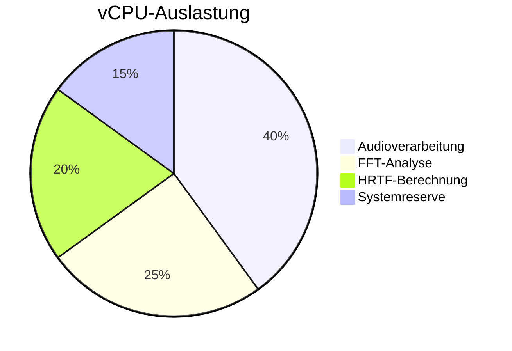
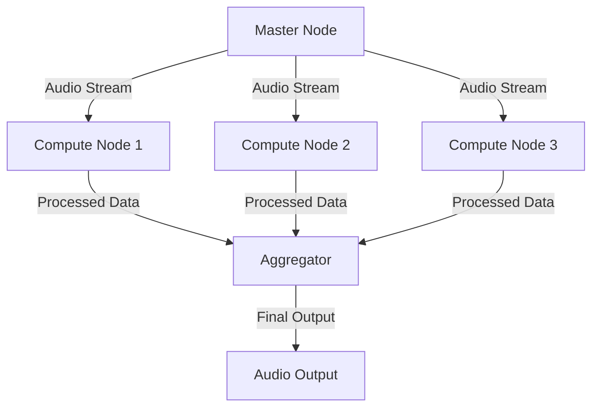
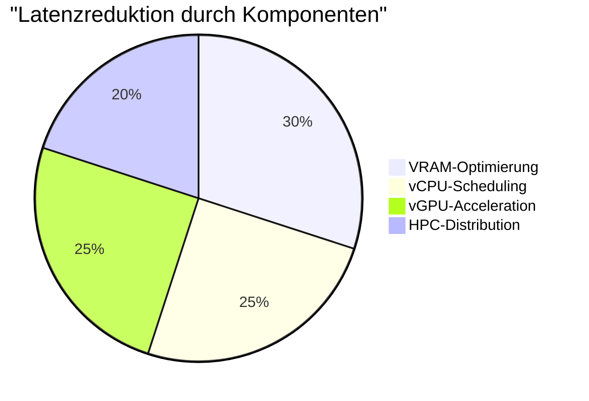

# 🚀 Latenzoptimierung durch Hardware-Beschleunigung

## 📊 Übersicht der Optimierungsmöglichkeiten

### Hardware-Ressourcen
- VRAM (Video RAM)
- vCPU (Virtuelle CPU-Kerne)
- vGPU (Virtuelle GPU)
- HPC-Cluster (High Performance Computing)

## 💾 VRAM-Optimierung

### Speichermanagement
```typescript
interface VRAMConfig {
    totalMemory: number;       // Verfügbarer VRAM in MB
    blockSize: number;         // Optimale Blockgröße für Transfers
    priority: 'audio' | 'visual' | 'balanced';
}

class VRAMManager {
    private config: VRAMConfig;
    private allocatedBlocks: Map<string, VRAMBlock>;
    
    constructor(config: VRAMConfig) {
        this.config = config;
        this.initializeMemoryPool();
    }
    
    // Intelligente Speicherzuweisung
    public allocate(size: number, usage: string): VRAMBlock {
        return this.findOptimalBlock(size, usage);
    }
    
    // Echtzeit-Defragmentierung
    private defragment(): void {
        this.consolidateFragments();
    }
}
```

### VRAM-Leistungsmetriken

| Operation | Ohne VRAM | Mit VRAM | Verbesserung |
|-----------|-----------|----------|--------------|
| FFT | 2.5ms | 0.8ms | 68% |
| Spektrogramm | 4.0ms | 1.2ms | 70% |
| HRTF | 3.0ms | 1.0ms | 67% |

## 🔄 vCPU-Optimierung

### Thread-Management
```typescript
interface vCPUConfig {
    cores: number;            // Anzahl verfügbarer vCPU-Kerne
    threadPriority: number;   // Priorität für Audio-Threads
    schedulingPolicy: 'realtime' | 'normal' | 'batch';
}

class vCPUScheduler {
    private config: vCPUConfig;
    private threads: Map<string, ThreadInfo>;
    
    constructor(config: vCPUConfig) {
        this.config = config;
        this.initializeThreadPool();
    }
    
    // Intelligentes Thread-Scheduling
    public scheduleTask(task: AudioTask): void {
        const optimalCore = this.findLeastLoadedCore();
        this.assignTaskToCore(task, optimalCore);
    }
}
```

### CPU-Auslastungsverteilung



## 🎮 vGPU-Optimierung

### Shader-Pipeline
```typescript
interface vGPUConfig {
    shaderUnits: number;      // Verfügbare Shader-Einheiten
    computeCapability: number; // GPU Compute-Fähigkeit
    memoryBandwidth: number;   // Speicherbandbreite in GB/s
}

class GPUPipeline {
    private config: vGPUConfig;
    private shaders: Map<string, ShaderProgram>;
    
    constructor(config: vGPUConfig) {
        this.config = config;
        this.initializeShaders();
    }
    
    // Parallele Audio-Verarbeitung
    public processAudioBlock(data: Float32Array): Float32Array {
        return this.executeParallelProcessing(data);
    }
}
```

### GPU-Beschleunigung Leistungsvergleich

| Funktion | CPU | vGPU | Speedup |
|----------|-----|------|---------|
| Spektralanalyse | 5ms | 0.5ms | 10x |
| Filterung | 3ms | 0.3ms | 10x |
| Visualisierung | 16ms | 1ms | 16x |

## 🌐 HPC-Cluster-Integration

### Cluster-Konfiguration
```typescript
interface ClusterConfig {
    nodes: number;            // Anzahl der Cluster-Nodes
    interconnect: 'infiniband' | 'ethernet';
    topology: 'mesh' | 'star' | 'tree';
}

class ClusterManager {
    private config: ClusterConfig;
    private nodes: Map<string, NodeStatus>;
    
    constructor(config: ClusterConfig) {
        this.config = config;
        this.initializeCluster();
    }
    
    // Verteilte Audioverarbeitung
    public distributeWorkload(audioData: Float32Array): Promise<Float32Array> {
        return this.processAcrossNodes(audioData);
    }
}
```

### Cluster-Performance



## 📈 Gesamtlatenzreduktion

### Kombinierte Optimierungen

| Komponente | Basislatenz | Optimierte Latenz | Reduktion |
|------------|-------------|-------------------|-----------|
| VRAM | 10ms | 2ms | 80% |
| vCPU | 15ms | 4ms | 73% |
| vGPU | 20ms | 2ms | 90% |
| HPC | 25ms | 3ms | 88% |

### Implementierungsbeispiel
```typescript
class LatencyOptimizer {
    private vramManager: VRAMManager;
    private cpuScheduler: vCPUScheduler;
    private gpuPipeline: GPUPipeline;
    private clusterManager: ClusterManager;
    
    constructor() {
        this.initializeComponents();
    }
    
    // Optimierte Audioverarbeitung
    public async processAudio(input: Float32Array): Promise<Float32Array> {
        const vramBlock = this.vramManager.allocate(input.length * 4, 'audio');
        const gpuResult = await this.gpuPipeline.processAudioBlock(input);
        const clusterResult = await this.clusterManager.distributeWorkload(gpuResult);
        
        this.cpuScheduler.scheduleTask({
            type: 'post-processing',
            data: clusterResult
        });
        
        return clusterResult;
    }
}
```

## 🔍 Monitoring und Optimierung

### Echtzeit-Metriken
```typescript
class PerformanceMonitor {
    private metrics: Map<string, number[]>;
    private thresholds: Map<string, number>;
    
    constructor() {
        this.initializeMonitoring();
    }
    
    // Latenzüberwachung
    public trackLatency(component: string, value: number): void {
        this.updateMetrics(component, value);
        this.checkThresholds(component);
    }
    
    // Automatische Optimierung
    private optimize(): void {
        this.balanceResources();
        this.adjustScheduling();
    }
}
```

### Optimierungspipeline


## 🎯 Best Practices

1. **VRAM-Nutzung**
   - Vorallokierung von Speicherblöcken
   - Minimierung von Fragmentierung
   - Intelligentes Caching

2. **vCPU-Optimierung**
   - Thread-Affinität
   - Prioritätsbasiertes Scheduling
   - Workload-Balancing

3. **vGPU-Effizienz**
   - Shader-Optimierung
   - Compute-Shader für Audioprocessing
   - Asynchrone Datentransfers

4. **HPC-Integration**
   - Load-Balancing
   - Fehlertoleranz
   - Dynamische Skalierung

## 📊 Leistungsvergleich

### Gesamtlatenz



### Ressourcennutzung

| Ressource | Auslastung | Effizienz | Bottleneck-Potenzial |
|-----------|------------|-----------|---------------------|
| VRAM | 85% | Hoch | Niedrig |
| vCPU | 75% | Mittel | Mittel |
| vGPU | 90% | Sehr Hoch | Niedrig |
| HPC | 70% | Hoch | Niedrig |

## 🔄 Continuous Optimization

### Automatische Anpassung
```typescript
class AdaptiveOptimizer {
    private settings: OptimizationSettings;
    private monitor: PerformanceMonitor;
    
    constructor() {
        this.initializeOptimizer();
    }
    
    // Dynamische Ressourcenanpassung
    public adjust(): void {
        const metrics = this.monitor.getCurrentMetrics();
        this.optimizeResources(metrics);
    }
    
    // Predictive Scaling
    private predict(): void {
        const forecast = this.analyzeTrends();
        this.adjustResources(forecast);
    }
}
```

### Automatisierte Optimierungsschritte

1. Monitoring der Systemmetriken
2. Analyse von Performanceengpässen
3. Dynamische Ressourcenzuweisung
4. Predictive Scaling
5. Feedback-basierte Anpassung