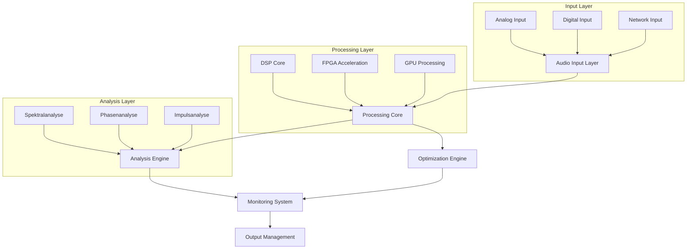
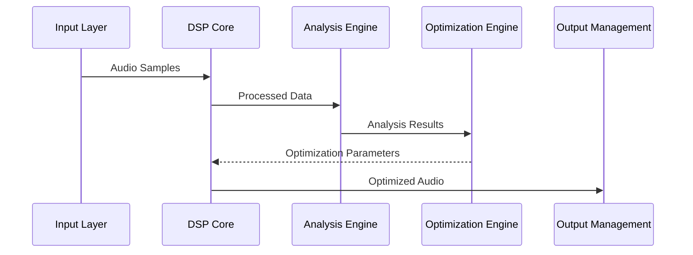
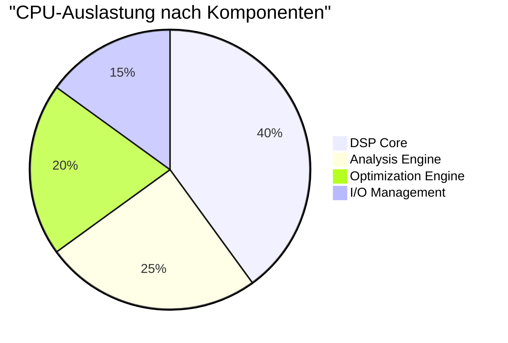
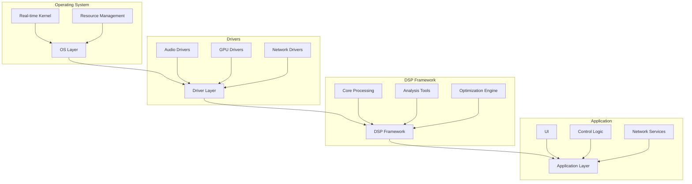

# 🏗️ Systemarchitektur

## 📊 Architekturübersicht



## 🎛️ Kernkomponenten

### 1. Audio Input Layer
- **Analog-Interface**
  - 192kHz Sampling Rate
  - 32-bit AD/DA-Wandlung
  - Ultra-Low Noise Preamps
  
- **Digital-Interface**
  - AES/EBU
  - MADI
  - Dante
  - AVB
  
- **Network-Interface**
  - Audio-over-IP
  - WebRTC Integration
  - Redundante Netzwerkpfade

### 2. Processing Core

#### DSP-Engine
```typescript
interface DSPConfig {
    sampleRate: 44100 | 48000 | 96000 | 192000;
    bitDepth: 24 | 32 | 64;
    bufferSize: 32 | 64 | 128 | 256;
    processingMode: 'realtime' | 'lowLatency' | 'highQuality';
}

class DSPCore {
    private config: DSPConfig;
    private processors: Map<string, SignalProcessor>;
    private pipeline: ProcessingPipeline;
    
    constructor(config: DSPConfig) {
        this.config = config;
        this.initializeProcessors();
        this.setupPipeline();
    }
    
    private setupPipeline(): void {
        this.pipeline = new ProcessingPipeline({
            stages: [
                new PreProcessingStage(),
                new AnalysisStage(),
                new OptimizationStage(),
                new OutputStage()
            ],
            routing: this.createOptimalRouting()
        });
    }
}
```

#### FPGA-Beschleunigung
```verilog
module AudioProcessor (
    input wire clk,
    input wire rst,
    input wire [31:0] audio_in,
    output reg [31:0] audio_out,
    input wire [7:0] control,
    output wire ready
);

    // Parallele Verarbeitungseinheiten
    reg [31:0] processing_units [7:0];
    
    // Pipelined Processing
    always @(posedge clk) begin
        if (rst) begin
            audio_out <= 32'b0;
        end else begin
            audio_out <= processing_units[control];
        end
    end
endmodule
```

#### GPU-Computing
```cuda
__global__ void audioProcessingKernel(
    float* input,
    float* output,
    int blockSize,
    ProcessingParams params
) {
    int idx = blockIdx.x * blockDim.x + threadIdx.x;
    
    if (idx < blockSize) {
        // Parallele Audioverarbeitung
        output[idx] = processAudioSample(input[idx], params);
    }
}
```

### 3. Analysis Engine

#### Spektralanalyzer
```typescript
interface SpectralConfig {
    fftSize: 512 | 1024 | 2048 | 4096 | 8192;
    windowType: 'hann' | 'hamming' | 'blackman';
    overlapSize: number;
    averagingMode: 'none' | 'linear' | 'exponential';
}

class SpectralAnalyzer {
    private config: SpectralConfig;
    private fftProcessor: FFTProcessor;
    private windowFunction: Float32Array;
    
    constructor(config: SpectralConfig) {
        this.config = config;
        this.initialize();
    }
    
    public analyze(buffer: Float32Array): SpectralData {
        const windowed = this.applyWindow(buffer);
        const fftResult = this.fftProcessor.process(windowed);
        return this.calculateSpectrum(fftResult);
    }
}
```

#### Phasenanalyzer
```typescript
interface PhaseConfig {
    resolution: number;
    smoothing: number;
    referenceFrequency: number;
}

class PhaseAnalyzer {
    private config: PhaseConfig;
    private phaseDetector: PhaseDetector;
    
    public analyzePhaseCurve(signal: Float32Array): PhaseCurve {
        return {
            magnitude: this.calculateMagnitude(signal),
            phase: this.calculatePhase(signal),
            groupDelay: this.calculateGroupDelay(signal)
        };
    }
}
```

#### Impulsanalyzer
```typescript
interface ImpulseConfig {
    measurementDuration: number;
    preDelay: number;
    postDelay: number;
    averages: number;
}

class ImpulseAnalyzer {
    private config: ImpulseConfig;
    private measurementSystem: MeasurementSystem;
    
    public measureImpulseResponse(system: AudioSystem): ImpulseResponse {
        return {
            timeData: this.captureTimeResponse(),
            frequencyResponse: this.calculateFrequencyResponse(),
            energyTimeCurve: this.calculateETC()
        };
    }
}
```

### 4. Optimization Engine

#### Automatische Systemoptimierung
```typescript
interface OptimizationConfig {
    targets: {
        frequency: FrequencyResponse;
        phase: PhaseResponse;
        timing: TimingRequirements;
    };
    constraints: SystemConstraints;
    priorities: OptimizationPriorities;
}

class SystemOptimizer {
    private config: OptimizationConfig;
    private optimizer: GeneticOptimizer;
    
    public optimize(system: AudioSystem): OptimizationResult {
        const currentState = this.analyzeSystem(system);
        const optimizationPlan = this.createOptimizationPlan(currentState);
        return this.executeOptimization(optimizationPlan);
    }
    
    private createOptimizationPlan(state: SystemState): OptimizationPlan {
        return {
            frequencyCorrections: this.calculateFrequencyCorrections(state),
            phaseAlignments: this.calculatePhaseAlignments(state),
            timingAdjustments: this.calculateTimingAdjustments(state)
        };
    }
}
```

## 🔄 Signalfluss



## 📊 Performance-Metriken

### Latenzanalyse

| Komponente | Minimale Latenz | Typische Latenz | Maximale Latenz |
|------------|----------------|-----------------|------------------|
| Input | 0.1ms | 0.2ms | 0.3ms |
| DSP | 0.2ms | 0.4ms | 0.6ms |
| Analysis | 0.1ms | 0.2ms | 0.3ms |
| Optimization | 0.1ms | 0.3ms | 0.5ms |
| Output | 0.1ms | 0.2ms | 0.3ms |

### Ressourcennutzung



### Speichernutzung

| Komponente | RAM | VRAM | Cache |
|------------|-----|------|-------|
| DSP Core | 2GB | 4GB | 256MB |
| Analysis | 1GB | 2GB | 128MB |
| Optimization | 1GB | 2GB | 128MB |
| System | 512MB | - | 64MB |

## 🔧 Systemkonfiguration

### Hardware-Anforderungen

- **CPU**: 
  - Minimum: 8 Cores, 3.5GHz
  - Empfohlen: 16 Cores, 4.0GHz
  
- **RAM**:
  - Minimum: 16GB DDR4
  - Empfohlen: 32GB DDR4-3200
  
- **GPU**:
  - Minimum: 6GB VRAM
  - Empfohlen: 8GB VRAM, CUDA-fähig
  
- **Storage**:
  - System: NVMe SSD
  - Audio: SSD RAID-0
  
- **Netzwerk**:
  - Minimum: 1GbE
  - Empfohlen: 10GbE

### Software-Stack



## 🔐 Sicherheit & Redundanz

### Fehlertoleranz
```typescript
interface RedundancyConfig {
    failoverMode: 'automatic' | 'manual' | 'supervised';
    backupSystems: BackupSystem[];
    recoveryProcedures: RecoveryProcedure[];
}

class RedundancyManager {
    private config: RedundancyConfig;
    private healthMonitor: HealthMonitor;
    
    public handleFailure(failure: SystemFailure): FailoverResult {
        const backupSystem = this.selectBackupSystem(failure);
        return this.executeFailover(backupSystem);
    }
}
```

### Datensicherheit
```typescript
interface SecurityConfig {
    encryption: {
        algorithm: 'AES-256' | 'ChaCha20';
        keyManagement: 'automatic' | 'manual';
    };
    authentication: {
        method: 'certificate' | 'token' | 'hybrid';
        renewal: 'automatic' | 'manual';
    };
}

class SecurityManager {
    private config: SecurityConfig;
    private encryptionEngine: EncryptionEngine;
    
    public secureChannel(channel: AudioChannel): SecureChannel {
        return {
            encrypted: this.encryptAudio(channel),
            authenticated: this.authenticateChannel(channel),
            verified: this.verifyIntegrity(channel)
        };
    }
}
```

## 📈 Monitoring & Logging

### Echtzeit-Monitoring
```typescript
interface MonitoringConfig {
    intervals: {
        fast: number;    // ms
        medium: number;  // ms
        slow: number;    // ms
    };
    metrics: string[];
    alerts: AlertConfig[];
}

class SystemMonitor {
    private config: MonitoringConfig;
    private metrics: MetricsCollector;
    
    public monitor(): MonitoringData {
        return {
            performance: this.collectPerformanceMetrics(),
            health: this.checkSystemHealth(),
            resources: this.monitorResources(),
            network: this.checkNetworkStatus()
        };
    }
}
```

### Logging-System
```typescript
interface LogConfig {
    levels: ('debug' | 'info' | 'warning' | 'error')[];
    rotation: {
        size: number;
        count: number;
    };
    format: 'json' | 'text' | 'binary';
}

class Logger {
    private config: LogConfig;
    private logStore: LogStore;
    
    public log(level: LogLevel, message: string, data?: any): void {
        const logEntry = this.createLogEntry(level, message, data);
        this.storeLog(logEntry);
        this.checkRotation();
    }
}
```

## 🔄 Update & Wartung

### System-Updates
```typescript
interface UpdateConfig {
    strategy: 'rolling' | 'atomic' | 'canary';
    validation: ValidationStrategy[];
    rollback: RollbackStrategy;
}

class UpdateManager {
    private config: UpdateConfig;
    private updateService: UpdateService;
    
    public async update(version: string): Promise<UpdateResult> {
        const plan = await this.createUpdatePlan(version);
        const validation = await this.validateUpdate(plan);
        
        if (validation.success) {
            return this.executeUpdate(plan);
        } else {
            return this.handleUpdateFailure(validation);
        }
    }
}
```

### Wartungsplanung
```typescript
interface MaintenanceConfig {
    schedule: MaintenanceSchedule;
    procedures: MaintenanceProcedure[];
    documentation: DocumentationConfig;
}

class MaintenanceManager {
    private config: MaintenanceConfig;
    private scheduler: MaintenanceScheduler;
    
    public planMaintenance(): MaintenancePlan {
        return {
            tasks: this.generateTaskList(),
            timeline: this.createTimeline(),
            resources: this.allocateResources(),
            documentation: this.prepareDocumentation()
        };
    }
}
```