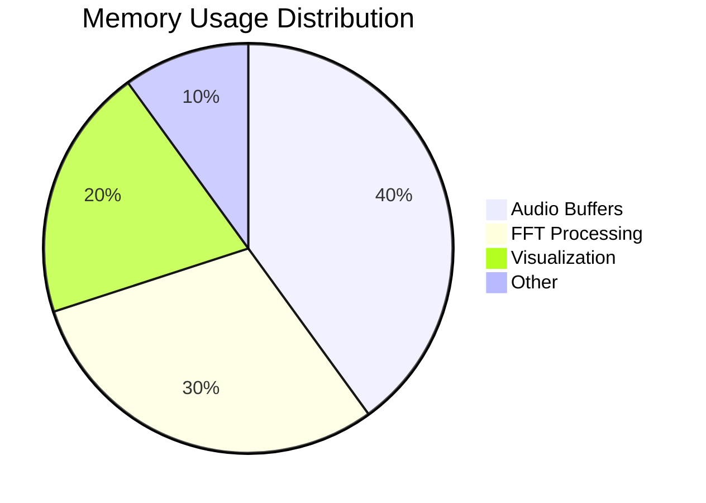
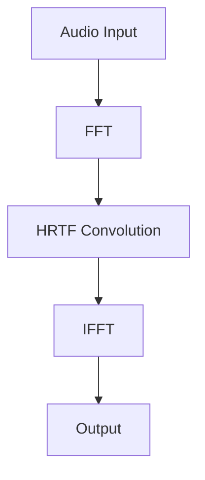
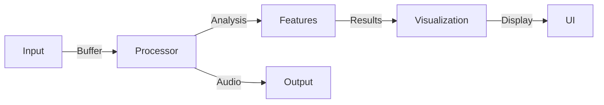
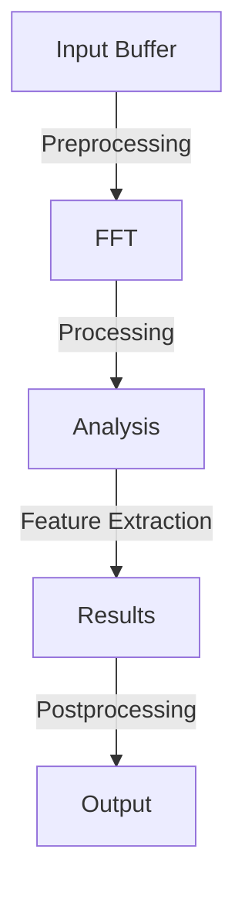
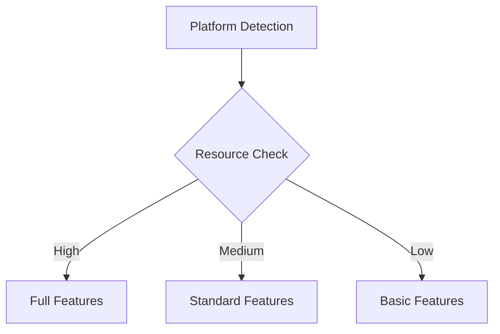
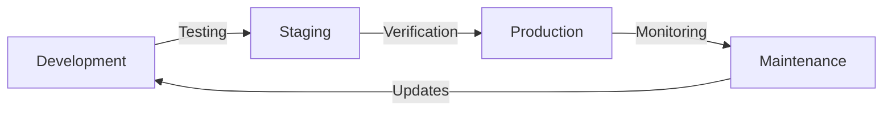
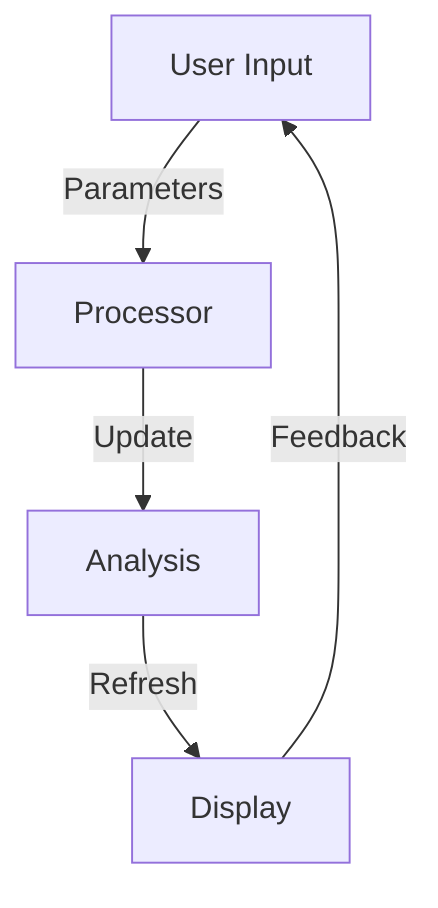

# 🔧 Technical Specifications

## 🎵 Audio Processing Capabilities

### Sample Rate Support
- 44.1 kHz (Standard)
- 48 kHz (Professional)
- 96 kHz (High Resolution)
- 192 kHz (Ultra High Resolution)

### Bit Depth
- 16-bit (Consumer)
- 24-bit (Professional)
- 32-bit float (Studio)

## 🔊 Analysis Features

### Time Domain Analysis
```javascript
class TimeAnalyzer {
    constructor(options) {
        this.sampleRate = options.sampleRate || 44100;
        this.bufferSize = options.bufferSize || 2048;
    }

    analyze(buffer) {
        // Implementation details for time domain analysis
        return {
            rms: this.calculateRMS(buffer),
            peak: this.findPeak(buffer),
            crest: this.calculateCrestFactor(buffer)
        };
    }
}
```

### Frequency Domain Analysis
```javascript
class FrequencyAnalyzer {
    constructor(options) {
        this.fft = new FFT(options.fftSize || 2048);
        this.window = options.window || 'hann';
    }

    analyze(buffer) {
        // Implementation details for frequency analysis
        return {
            spectrum: this.fft.forward(buffer),
            peaks: this.findPeaks(),
            centroid: this.calculateCentroid()
        };
    }
}
```

## 📊 Performance Metrics

### CPU Usage

| Operation | Usage (%) | Priority |
|-----------|-----------|----------|
| FFT | 15-20 | High |
| Time Analysis | 5-10 | Medium |
| Visualization | 10-15 | Low |

### Memory Footprint



## 🔍 Advanced Features

### Room Acoustics Simulation

```javascript
class RoomSimulator {
    constructor(dimensions) {
        this.dimensions = dimensions;
        this.materials = new Map();
        this.sources = [];
        this.listeners = [];
    }

    addMaterial(surface, coefficient) {
        this.materials.set(surface, coefficient);
    }

    calculateReverberation() {
        // Implementation details
    }
}
```

### HRTF Processing



## 🛠️ Implementation Details

### Core Components

```typescript
interface AudioProcessor {
    sampleRate: number;
    bufferSize: number;
    channels: number;
    
    process(input: Float32Array): Float32Array;
    analyze(): AnalysisResult;
    configure(options: ProcessorOptions): void;
}

interface AnalysisResult {
    timeData: TimeAnalysis;
    freqData: FrequencyAnalysis;
    statistics: Statistics;
}
```

### Data Flow



## 📈 Optimization Techniques

### Buffer Management

```typescript
class BufferManager {
    private buffers: Float32Array[];
    private readIndex: number;
    private writeIndex: number;

    constructor(size: number, count: number) {
        this.buffers = Array(count)
            .fill(null)
            .map(() => new Float32Array(size));
    }

    write(data: Float32Array): void {
        // Implementation
    }

    read(): Float32Array {
        // Implementation
    }
}
```

### Processing Pipeline



## 🔐 Security Measures

### Data Protection

```typescript
interface SecurityConfig {
    encryption: boolean;
    anonymization: boolean;
    accessControl: AccessControlList;
}

class SecureProcessor implements AudioProcessor {
    private security: SecurityConfig;
    private encryptor: DataEncryptor;

    constructor(config: SecurityConfig) {
        this.security = config;
        this.encryptor = new DataEncryptor();
    }

    process(input: Float32Array): Float32Array {
        // Secure processing implementation
    }
}
```

## 📱 Cross-Platform Support

### Platform-Specific Optimizations

| Platform | CPU Usage | Memory Limit | Features |
|----------|-----------|--------------|----------|
| Desktop | 100% | Unlimited | All |
| Mobile | 60% | 1GB | Limited |
| Web | 40% | Browser | Basic |

### Adaptive Processing



## 🎛️ Configuration Options

### Audio Settings

```typescript
interface AudioConfig {
    sampleRate: 44100 | 48000 | 96000;
    bitDepth: 16 | 24 | 32;
    channels: 1 | 2;
    bufferSize: 512 | 1024 | 2048 | 4096;
}
```

### Processing Options

```typescript
interface ProcessingOptions {
    fftSize: number;
    windowType: 'hann' | 'hamming' | 'blackman';
    smoothingTimeConstant: number;
    minDecibels: number;
    maxDecibels: number;
}
```

## 🔄 Update and Maintenance

### Version Control



### Performance Monitoring

| Metric | Target | Warning | Critical |
|--------|--------|---------|----------|
| Latency | <10ms | >20ms | >50ms |
| CPU | <30% | >60% | >80% |
| Memory | <500MB | >1GB | >2GB |

## 📊 Visualization Components

### Real-time Display

```typescript
class Visualizer {
    private canvas: HTMLCanvasElement;
    private ctx: CanvasRenderingContext2D;
    private data: AnalysisResult;

    constructor(canvas: HTMLCanvasElement) {
        this.canvas = canvas;
        this.ctx = canvas.getContext('2d');
    }

    draw(): void {
        // Implementation
    }

    update(data: AnalysisResult): void {
        this.data = data;
        this.draw();
    }
}
```

### Interactive Controls

