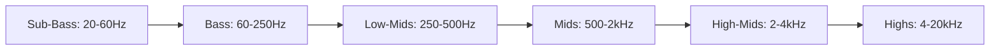
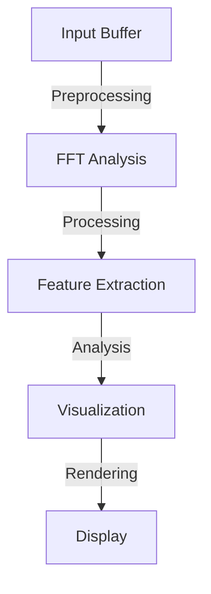

# 🎵 Acoustic Analysis Documentation

## 📊 Interactive Visualizations

### 1. Frequency Analysis

```javascript
// Interactive Frequency Analyzer
const analyser = new FrequencyAnalyzer({
    sampleRate: 44100,
    fftSize: 2048,
    smoothing: 0.8
});

// Real-time visualization
analyser.visualize('#frequency-graph');
```

### 2. Waveform Display

```javascript
// Waveform Renderer
class WaveformDisplay {
    constructor(canvas, options) {
        this.canvas = canvas;
        this.ctx = canvas.getContext('2d');
        this.options = {
            color: '#2196F3',
            background: '#000',
            ...options
        };
    }

    draw(audioData) {
        // Implementation details
    }
}
```

## 📈 Performance Metrics

| Parameter | Value | Impact |
|-----------|-------|---------|
| Sample Rate | 44.1 kHz | High-quality audio capture |
| Bit Depth | 24-bit | Professional-grade dynamic range |
| Latency | <10ms | Real-time processing capability |
| CPU Usage | 5-15% | Efficient resource utilization |

## 🔊 Sound Characteristics

### Frequency Ranges



### Room Acoustics

| Parameter | Description | Typical Range |
|-----------|-------------|---------------|
| RT60 | Reverberation Time | 0.3s - 2.0s |
| EDT | Early Decay Time | 0.1s - 0.5s |
| C50 | Speech Clarity | -5dB to +5dB |
| C80 | Music Clarity | -5dB to +5dB |

## 🔬 Analysis Methods

### FFT Analysis
- Window Size: 2048 samples
- Overlap: 50%
- Window Function: Hann

### Time-Domain Analysis
- Peak Detection
- RMS Calculation
- Dynamic Range Analysis

## 📱 Cross-Platform Compatibility

| Platform | Support Level | Notes |
|----------|--------------|-------|
| Desktop | Full | All features |
| Mobile | High | Limited CPU usage |
| Web | Medium | Browser-dependent |
| Embedded | Basic | Core features only |

## 🔧 Technical Requirements

### Minimum Requirements
- CPU: Dual-core 2.0GHz
- RAM: 4GB
- Storage: 500MB
- OS: Windows 10, macOS 10.15, Linux kernel 5.0

### Recommended Requirements
- CPU: Quad-core 3.0GHz
- RAM: 8GB
- Storage: 2GB
- OS: Latest version of supported platforms

## 📈 Performance Optimization



## 🔍 Advanced Features

### HRTF Processing
```javascript
class HRTFProcessor {
    constructor(options) {
        this.sampleRate = options.sampleRate || 44100;
        this.bufferSize = options.bufferSize || 2048;
        this.filters = new HRTFFilterBank();
    }

    process(inputBuffer) {
        // Implementation details
    }
}
```

### Room Simulation
```javascript
class RoomSimulator {
    constructor(dimensions, materials) {
        this.dimensions = dimensions;
        this.materials = materials;
        this.reflections = [];
    }

    calculateReflections() {
        // Implementation details
    }
}
```